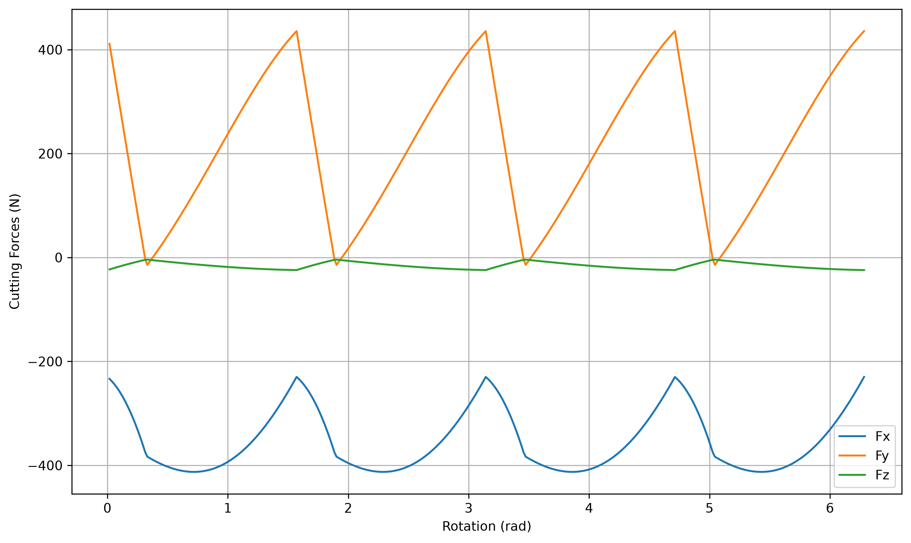
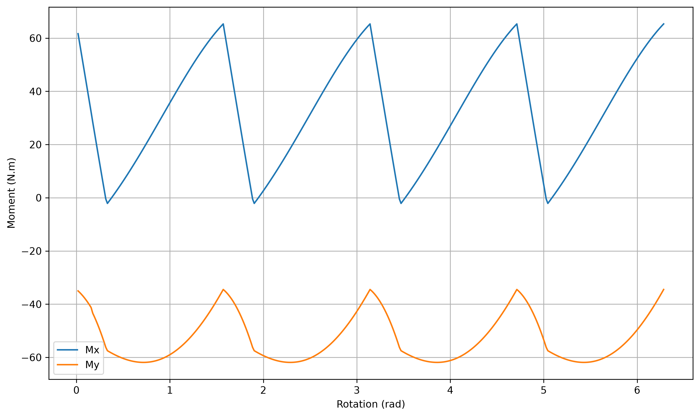

# Milling Force Model (Altintas)

<!-- Banner will be added later -->
<!-- assets/banner.png -->

A Python implementation of an Altintas-style mechanistic milling force model for helical end milling.

This project predicts cutting force components, torque, cutting power, and tool bending moments based on cutter geometry, cutting parameters, tooth engagement conditions, and calibrated cutting force coefficients.

> **Educational Purpose Notice**  
> This repository is developed for educational and research-oriented learning purposes.  
> It is not intended for direct industrial process certification, safety-critical machining decisions, or production validation without experimental verification.

---

## Overview

This repository contains a MATLAB-to-Python port of a mechanistic milling force model inspired by classical milling mechanics and Altintas-style cutting force prediction.

The model estimates:

- Cutting force components: `Fx`, `Fy`, `Fz`
- Tangential cutting force: `Ft`
- Cutting torque
- Cutting power
- Tool bending moments: `Mx`, `My`
- Average bending moment: `Mx_ave`
- Tooth engagement conditions for helical end milling

The force calculation includes multiple tooth entry and exit conditions along the axial depth of cut, following the logic of the original MATLAB implementation.

---

## Project Motivation

Milling force prediction is useful for understanding:

- Tool loading
- Cutter deflection
- Spindle and fixture loading
- Process parameter effects
- Cutting coefficient calibration
- Machining stability studies
- Force-based process monitoring

This project was created as a learning-oriented Python implementation to better understand the relationship between milling parameters, cutter geometry, force coefficients, and resulting force/moment profiles.

---

## Features

- MATLAB-to-Python implementation
- Mechanistic milling force model
- Helical end mill engagement logic
- Up milling and down milling support
- Calibrated cutting force coefficients
- Numerical force waveform calculation over one spindle revolution
- Analytical average force comparison
- Tool bending moment calculation
- Force and moment plots
- MIT licensed educational repository

---

## Cutting Parameters Used in the Example

The default example in `main.py` uses the following cutting and tool parameters:

| Parameter | Value | Description | Unit |
|---|---:|---|---|
| `Z` | `5.08` | Axial depth of cut | mm |
| `b` | `9.05` | Width of cut | mm |
| `ft` | `0.05` | Feed per tooth | mm/tooth |
| `V` | `30` | Cutting speed | m/min |
| `MS` | `1` | Milling style, `1 = up milling`, `2 = down milling` | - |
| `R` | `9.05` | Cutter radius | mm |
| `N` | `4` | Number of teeth | - |
| `beta` | `30` | Helix angle | degree |
| `alphar` | `12` | Radial rake angle | degree |
| `tau` | `613` | Shear stress | MPa |
| `Kte` | `24` | Input tangential edge force coefficient | N/mm |
| `Kre` | `42` | Input radial edge force coefficient | N/mm |
| `Kae` | `2` | Input axial edge force coefficient | N/mm |
| `L` | `150` | Tool overhang distance | mm |

---

## Cutting Force Coefficients

The code first calculates theoretical cutting force coefficients using oblique cutting relationships.  
Then, as in the original MATLAB implementation, the model uses calibrated force coefficients for the final force prediction.

### Cutting Force Components

### Tool Bending Moments

